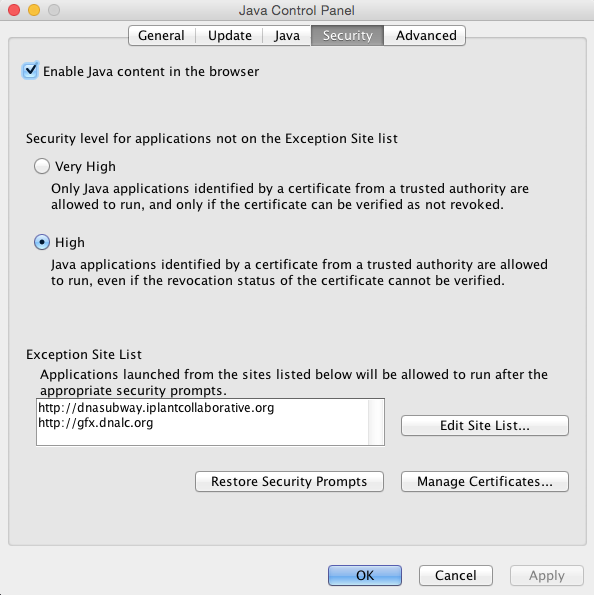

# Java Configuration for Simulation Server

## Web Browser

[Firefox](https://www.mozilla.org/en-US/firefox) is highly recommended to use Bioservers. 

## Java Configuration Steps

1. Open the Java Security Settings
    - PC: Open **Control Panel > Programs > Java**
    - Mac: Open **System Preferences > Java**
  
2. Click the **Security** tab and check **Enable Java in the Browser**. 
3. Under 'Exception Site List' click **Edit Site List...**
4. Click **Add** then add **http://www.bioservers.org**, next click **OK** and close the panel

## Access Bioservers and enable Java

1. Go to [http://www.bioservers.org/bioserver/](http://www.bioservers.org/bioserver/) and under 'Simulation Server' click **ENTER**. 
  
2. If Java is disabled look for and click the **Activate Java** link. 
3. You may get several security prompts depending on your version of Java, it is OK to run Java, and accept any warning. If you should be able to skip this step and update later if you choose. 
4. You should now see the simulation server. 
  

## Additional Help

###If Java is still not functioning:
Your web browser may be blocking it. You can directly unblock as follows:

#### Firefox

1. Open the Firefox browser or restart it, if it is already running
2. From the Firefox menu, select Tools, then click the Add-ons option
3. In the Add-ons Manager window, select Plugins
4. Click Java (TM) Platform plugin (Windows) or Java Applet Plug-in (Mac OS X) to select it
5. Check that the option selected is Ask to Activate or Always Activate or on older Firefox versions, click on the Enable button (if the button says Disable, Java is already enabled)

#### Internet Explorer

1. Click Tools and then Internet Options
2. Select the Security tab, and select the Custom Level button
3. Scroll down to Scripting of Java applets
4. Make sure the Enable radio button is checked
5. Click OK to save your preference 

#### Safari

1. Click on Safari and select Preferences
2. Choose the Security option
3. Select Allow Plug-ins, then click on Manage Website Settings
4. Click on the Java item, select an option (Ask, Allow or Allow Always) from the pulldown list When visiting other websites
5. Click Done, then close the Safari Preferences window

###If Java is not installed:

[Download Java](https://java.com/en/download/)